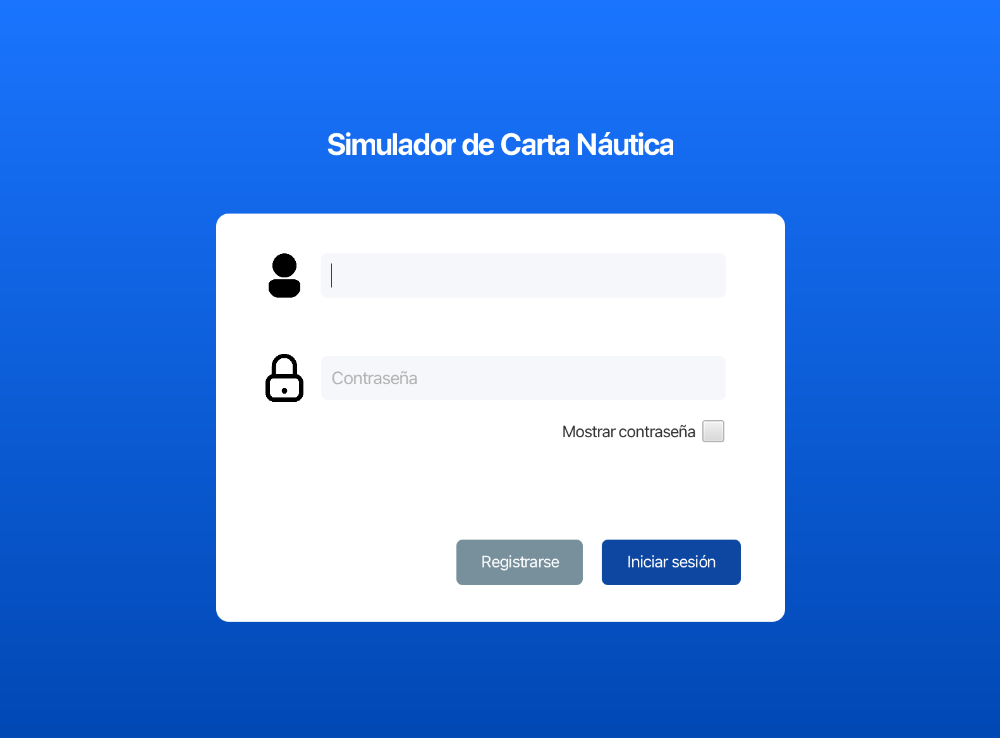
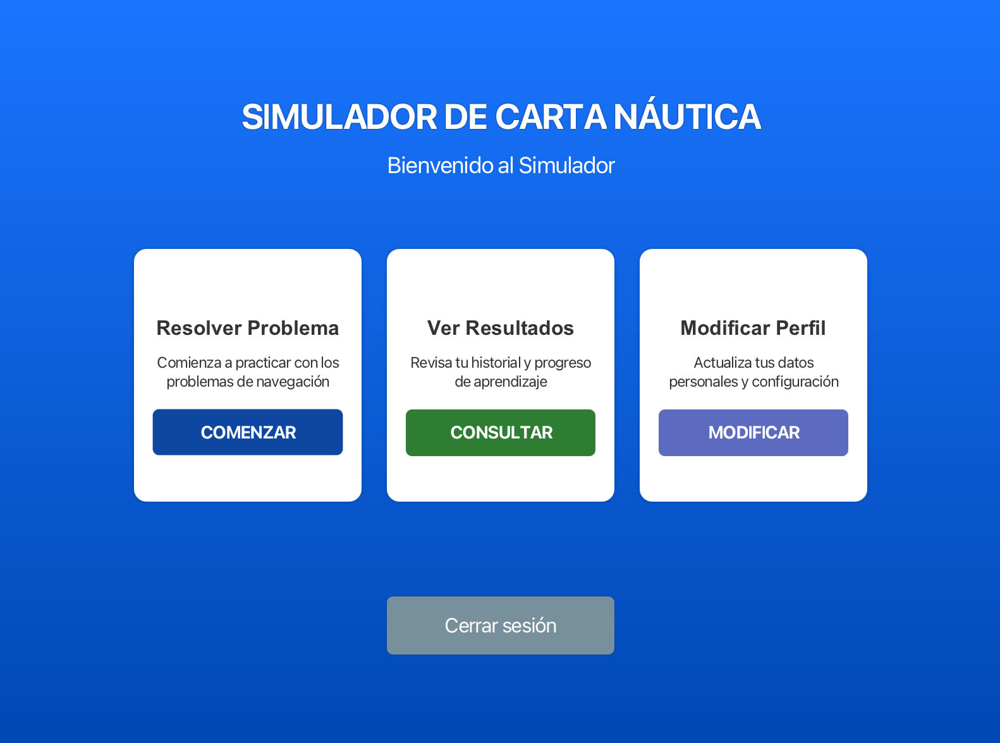
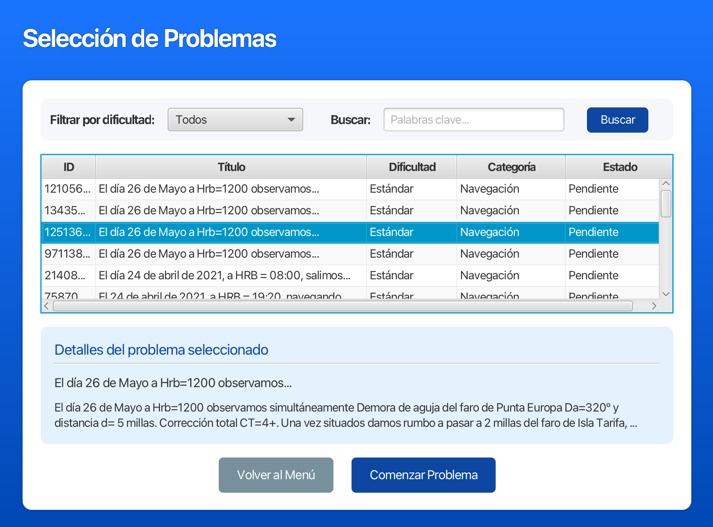
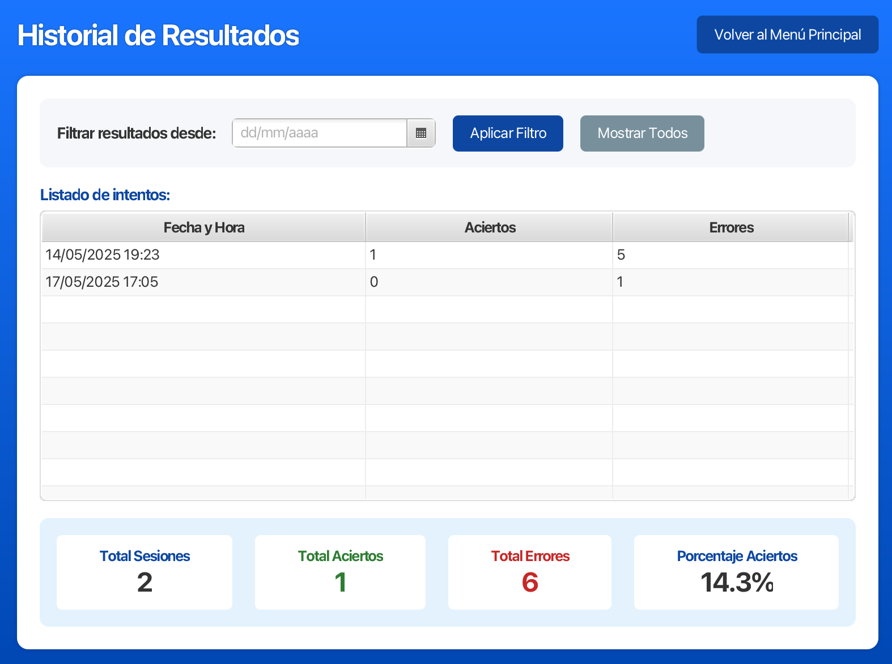

# Proyecto de Carta de Navegación - IPC

## Descripción del Proyecto

Este proyecto fue desarrollado para la asignatura de Interfaces Persona Computador (IPC) y consiste en una aplicación de escritorio para la realización y gestión de problemas de carta de navegación. La aplicación está desarrollada utilizando Java con JavaFX y SceneBuilder, siguiendo los principios de diseño de interfaces de usuario.

## Características Principales

- Sistema de autenticación de usuarios (login y registro)
- Interfaz intuitiva para la resolución de problemas de navegación
- Visualización de resultados y estadísticas
- Gestión de problemas y ejercicios
- Menú de navegación principal

## Tecnologías Utilizadas

- Java
- JavaFX
- SceneBuilder
- SQLite (para la base de datos)
- NetBeans IDE

## Estructura del Proyecto

```
├── src/
│   ├── app/
│   │   ├── Main.java
│   │   ├── controllers/
│   │   │   ├── LoginViewController.java
│   │   │   ├── RegisterViewController.java
│   │   │   ├── MainViewController.java
│   │   │   ├── ProfileViewController.java
│   │   │   ├── AllProblemsController.java
│   │   │   ├── ProblemViewController.java
│   │   │   └── ResultsViewController.java
│   │   └── views/
│   │       ├── LoginView.fxml
│   │       ├── RegisterView.fxml
│   │       ├── MainView.fxml
│   │       ├── ProfileView.fxml
│   │       ├── AllProblems.fxml
│   │       ├── ProblemView.fxml
│   │       └── ResultsView.fxml
│   ├── resources/
│   └── utils/
├── lib/
└── test/
```

## Capturas de Pantalla

La aplicación incluye las siguientes pantallas principales:

### Pantalla de Login



### Pantalla de Registro


### Menú Principal



### Lista de Problemas



### Vista de Problema Individual


### Resultados



## Requisitos del Sistema

- Java JDK 8 o superior
- JavaFX
- NetBeans IDE (recomendado para desarrollo)

## Instalación

1. Clonar el repositorio
2. Abrir el proyecto en NetBeans
3. Ejecutar el archivo build.xml para compilar el proyecto
4. Ejecutar la aplicación desde NetBeans

## Base de Datos

La aplicación utiliza una base de datos SQLite (data.db) para almacenar:

- Información de usuarios
- Problemas y ejercicios
- Resultados y estadísticas

## Contribución

Este proyecto fue desarrollado en parejas como parte de un trabajo académico para la asignatura de Interfaces Persona Computador.
