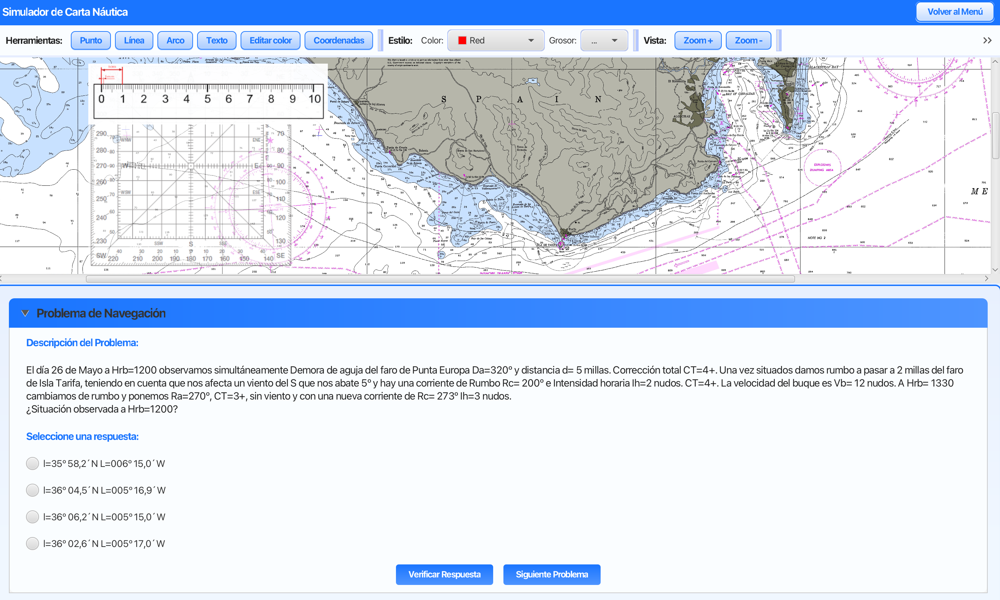

# 🧭 Proyecto de Carta de Navegación - IPC

<div align="center">
  
  
  [](https://www.java.com)
  [](https://openjfx.io/)
  [](https://gluonhq.com/products/scene-builder/)
  [](https://www.sqlite.org/)
  [](https://netbeans.apache.org/)
</div>

## 📝 Descripción del Proyecto

Este proyecto fue desarrollado para la asignatura de Interfaces Persona Computador (IPC) y consiste en una aplicación de escritorio para la realización y gestión de problemas de carta de navegación. La aplicación está desarrollada utilizando Java con JavaFX y SceneBuilder, siguiendo los principios de diseño de interfaces de usuario.

## ✨ Características Principales

- 🔐 Sistema de autenticación de usuarios (login y registro)
- 📊 Interfaz intuitiva para la resolución de problemas de navegación
- 📈 Visualización de resultados y estadísticas
- 📚 Gestión de problemas y ejercicios
- 🎯 Menú de navegación principal

## 🏗️ Estructura del Proyecto

```
├── src/
│   ├── app/
│   │   ├── Main.java
│   │   ├── controllers/
│   │   │   ├── LoginViewController.java
│   │   │   ├── RegisterViewController.java
│   │   │   ├── MainViewController.java
│   │   │   ├── ProfileViewController.java
│   │   │   ├── AllProblemsController.java
│   │   │   ├── ProblemViewController.java
│   │   │   └── ResultsViewController.java
│   │   └── views/
│   │       ├── LoginView.fxml
│   │       ├── RegisterView.fxml
│   │       ├── MainView.fxml
│   │       ├── ProfileView.fxml
│   │       ├── AllProblems.fxml
│   │       ├── ProblemView.fxml
│   │       └── ResultsView.fxml
│   ├── resources/
│   └── utils/
├── lib/
└── test/
```

## 🖼️ Capturas de Pantalla

### 🔑 Pantalla de Login

<div align="center">
  
</div>

### ✍️ Pantalla de Registro

<div align="center">
  
</div>

### 🏠 Menú Principal

<div align="center">
  
</div>

### 📋 Lista de Problemas

<div align="center">
  
</div>

### 📝 Vista de Problema Individual

<div align="center">
  
</div>

### 📊 Resultados

<div align="center">
  
</div>

## 💻 Requisitos del Sistema

- Java JDK 8 o superior
- JavaFX
- NetBeans IDE (recomendado para desarrollo)

## 🚀 Instalación

1. Clonar el repositorio
2. Abrir el proyecto en NetBeans
3. Ejecutar el archivo build.xml para compilar el proyecto
4. Ejecutar la aplicación desde NetBeans

## 💾 Base de Datos

La aplicación utiliza una base de datos SQLite (data.db) para almacenar:

- Información de usuarios
- Problemas y ejercicios
- Resultados y estadísticas

## 👥 Contribución

Este proyecto fue desarrollado en parejas como parte de un trabajo académico para la asignatura de Interfaces Persona Computador.

---

<div align="center">
  <sub>Desarrollado para la asignatura de IPC</sub>
</div>
